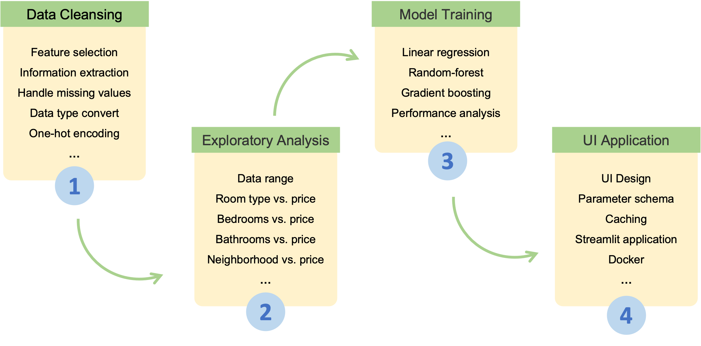
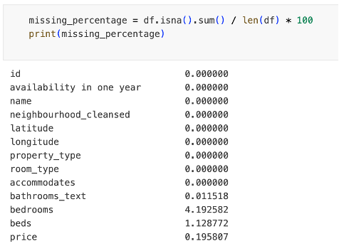
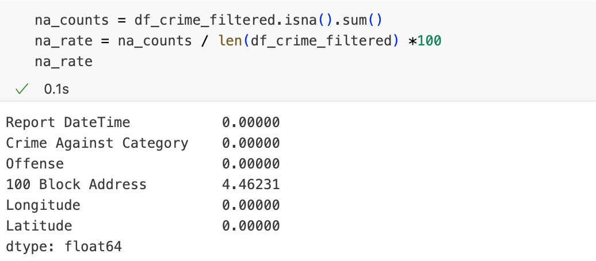
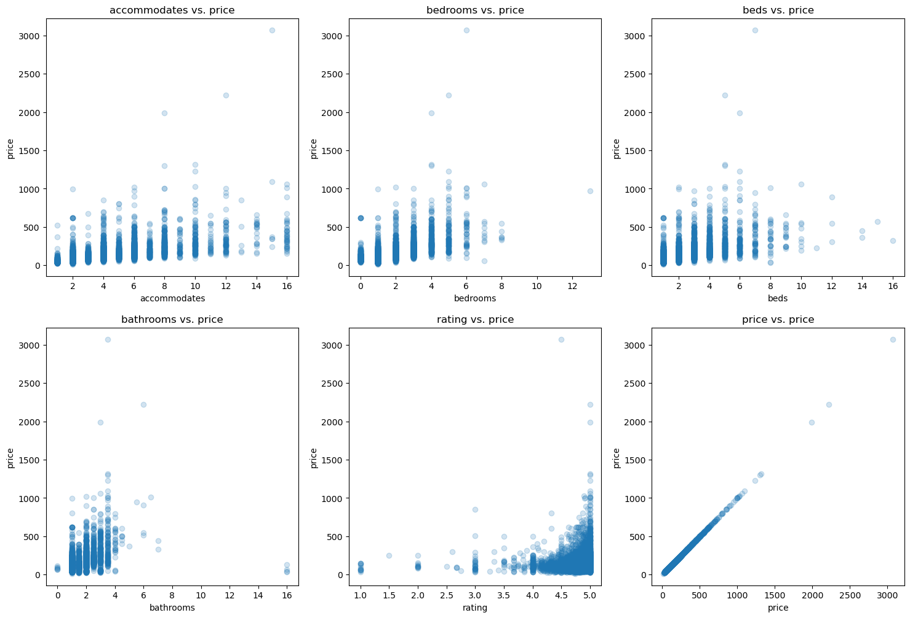
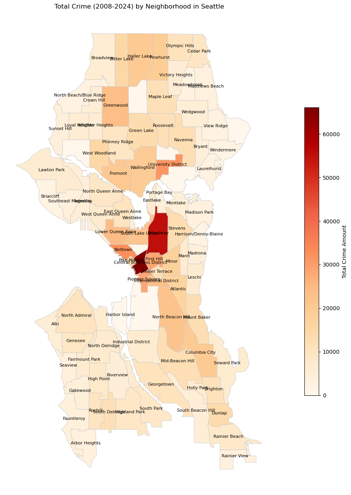
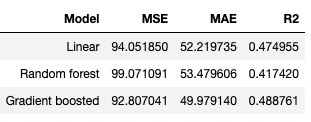
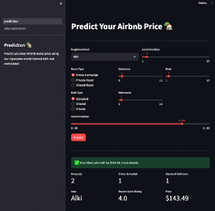

# Airbnb Pricing in Seattle

**Group members**: Chenchen Jiang, Hui Du, Jianjian Liu, Jiayang Liu


**Abstract**: In this project, we analyzed the relationships between consumer concerned features (accommodates, bedroom number, bathroom number, beds number, review rating score, neighborhood, room type and bathroom type) and lasted Airbnb rental price (2023-2024) in Seattle. We also considered crime data (2008-2024) as a potential factor by merging it into the main Airbnb dataset.  Raw dataset from [Airbnb](https://insideairbnb.com/) and [Data.Seattle.gov](https://data.seattle.gov/Public-Safety/SPD-Crime-Data-2008-Present/tazs-3rd5/about_data) were cleansed by replacing and dropping missing values, and categorical features were converted into one-hot encoding format. We explored both of Airbnb and Crime datasets through visualization to better understand the data distribution before modelling. We utilized three machine learning models—Linear Regression, Random Forest, and Gradient Boosting—for predicting suggested listing prices. Techniques such as Stacking and Bagging were applied respectively to optimize model performance. As a result, the Gradient Boosted model showed the best performance, evaluated using parameters including MSE, MAE, R2, and the residual curve. Furthermore, to provide user-friendly interface in applying our model, an online application was build by Streamlit, and we also generated a docker image for our applicaiton. In summary, this project represents an innovative and beneficial use of data science as it empowers property owners to make data-informed decisions before they list their homes.


## Introduction

Airbnb offers alternatives to the traditional hotel. It's an online application which enables people to lease or  rent short-term homestays, apartments and hotel rooms. As Airbnb grows into a global phenomenon, it will be useful to provide people with a price-comparison tool in choosing their rentals. In this project, we will explore the key factors which could make influnce on Airbnb rental prices, and our aim is to provide insightful information for the property owners before they enter Seattle Airbnb market.

The primary objective of this project is to predict the listing distribution and the price fluctuation of Airbnb in Seattle. This exploration will be accomplished by analyzing the relations among rental options (such as area, room type, bedroom number and so on) and price of Airbnb rooms. This analysis and application will provide valuable insights for guiding room selection, devising effective marketing strategies and enhancing homestay sales predictions.

Our analysis will mainly rely on Airbnb listings. To gain a comprehensive understanding of the data and establish relationships between variables, we will employ data mining techniques and exploratory data analysis. This will encompass data cleansing and preprocessing, regression and correlation analysis, the application of data mining models, and model evaluation and validation and more.




> workflow summary


In conclusion, we trained three different regression models, which showed acceptable performance in predicting the rental price. In addition, we provided the UI by Streamlit, as well as dockerized service to allow users get access to our model.


## Data Cleasing


### Feature Selection

The ultimate goal of our project is to predict the price of Airbnb room for customers by giving information they care about when looking for a rental. In this way, features that customers will probably be interested in, including room type, accommodates, neighborhood, review ratings and so on, were selected for further analysis.

By exploring the Airbnb Listing dataset, we found that a few of information are provided explictly, including neighbourhood, review rating score, room type. However, other information users will be interested, such as bathroom type and bedroom and bathroom numbers, However, other information users will be interested, such as beds number, bedroom number and bathroom type, are implicitly included in columns like `name` and `bathroom_text`

As a result, all selected features are: neighborhood, room type, bathroom type, accommodates, bedroom number, bathroom number, beds number, and review rating. Among these features, 5 of them are numeric features (accommodates, bedroom number, bathroom number, beds number, and review rating), and other 3 (neighborhood, room type and bathroom type) are categorical features.


For the extra Crime dataset, we have retained several key features for further use: report datetime, crime category, offense parent group, offense, address, longitude, and latitude, which are all categorical features. 


### Handling of Missing Values and Information Extraction

Our goal will be given the prediction of `price` in this project, for Airbnb Listing dataset, less than 5% values are missing in each feature, these records will be simply removed from further analysis. Since some of the selected features are implicted included in more than one columns, our next task is to extract as much information as we can to fill our features with valid and reasonable values. In summary, the method and logic we applied were listed below:

* **neighborhood**: explicitly included in the `neighbourhood` column
* **room type**: explicitly included in the `room_type` column
* **bedroom number**: implicitly included in the `name` column
* **beds number**: implicitly included in the `name` column
* **bathroom type**: implicitly included in the `bathrooms_text` column
* **bathroom number**: implicitly included in the `bathrooms_text` column
* **review rating**: some of rating scores were missing from `review_scores_rating` column, for these records, we will try to extract the rating value from `name` column

Though we tried our best to extract information, chances exist that some of feature values will still be missing. In this way, we implied following workflow in handling those misssing values.

* **review rating**：missing values will be substituted using information extracted from column `name`

```mermaid
flowchart LR
    A[`rating`] --> B{missing?}
    B -- Yes --> C[extract from `name`]
    C --> D{still missing?}
    D -- No --> E
    D -- Yes --> F[set to -1]
    F --> E
    B -- No ------> E[End]
```

* **bedroom**: If bedroom is marked as `studio`, the bedroom number will be set as 0. Otherwise, missing values will be sustituted using information extracted from column `name`

```mermaid
flowchart LR
    A[`bedrooms`] --> B{missing?}
    B -- Yes --> C{studio?}
    C -- Yes --> E
    C -- No --> D[extract from `name`]
    D --> F{still missing?}
    F -- NO --> E
    F -- Yes --> G[set to -1]
    G --> E
    B ------- No ------> E[End]
```

* **bed numbers**: missing values will be sustituted using information extracted from column `name`

```mermaid
flowchart LR
    A[`beds`] --> B{missing?}
    B -- Yes --> C[extract from `name`]
    C --> D{still missing?}
    D -- No --> E
    D -- Yes --> F[set to -1]
    F --> E
    B -- No ------> E[End]
```




For the extra Crime dataset, only some address entries are missing (NA), but as these constitute only 4.67% of the data, we have opted to drop the rows with missing addresses.

* **report datetime**: explicitly included in the `Report DateTime` column
* **crime category**: explicitly included in the `Crime Against Category` column
* **offense parent group**: explicitly included in the `Offense Parent Group` column
* **offense**: explicitly included in the `Offense` column
* **address**: explicitly included in the `100 Block Address` column
* **longitude**: explicitly included in the `Longitude` column
* **latitude**: explicitly included in the `Latitude` column



In summary,  about less than 5% of records of has missing values and were dropped before we diving deeper.


> Overview of the dataset after missing values were dropped.

### Data Type and Encoding

At this point, missing values are either filled with information extracted from other relative columns or dropped for further analysis. By looking at the dataframe, we still have some work to do:

- `price` has to be float type rather than string
- Features including `neighbourhood`, `room_type` and `bath_type` are categorical data, we thus convert these values into one-hot encoding pattern.

Finally, our dataset for training the regression model includes 100 columns with 8500+ valid records. A brief summary of the dataset is listed below:


> Overview of the dataset we used to train the model


## Exploratory Analysis

### Data Range

Before moving into training the regression model using cleaned dataset, we first applied some intuitive analysis of the data. Interestingly, we observe some outliers in feature `price`: a few of rooms seem have incredibly high rental price. Further analysis showed that the upper quartile of `price` is `$187`, while the max price is `$10000`. Notably, only 6 rooms had price higher than `$4000`. Therefore, we identify rooms with price higher than `$4000` as outliers and removed them for model training. After removing the outliers, the highest price of rooms is `$3071`. However, it's reasonable because the house is prepared for up to 15 people!


> Data range


### Relations to Price

We next analyzed the possible relations between our selected features (both numerical and categorical features) and the price. As for numerical features (accommodates, bedrooms, beds, bathrooms, rating), though not so obvious, it seems that these features do have some relations to the price. However, it's hard to tell whether the price is influenced by the area of the house from the chart we have here. As for room and bath types, it seems that shared bedrooms or bathrooms are a little more inexpensive than the standard type.




> Preliminary relation analysis


> Preliminary relation analysis





## Model Training

In training the regression model, dataset was splitted into training set (70%) and testing set (30%), and three different regression models were trained for selecting the best. The models we trained were: linear regression, random-forest regression and gradient boosted regression tree.

**Linear Regression**: in the exploratory analysis part, we do observed some (though not obvious) realtion trends among some numeric features and the price. As this model assumes a linear relationship among dependent and independent features, we trained this model for a find the best-fitting straight line to predict the rental price.

**Random Forest Regression**: an ensemble learning method that builds multiple decision trees and averages their predictions to improve accuracy and reduce overfitting. It's one of the most widily used method and we thus trained the model to handle the high dimensionality of our dataset.

**Gradient boosted regression trees**: an ensemble learning method that builds a predictive model in a step-by-step manner. Different from the random-forest method, this model belongs to a stacking ensemble model. Therefore, we will use this model to make comparisons between different ensemble methods.

In evaluating our models, we analyzed the prediction error curve and residual error among the three models. 

* As for linear regression model, the fitting level seemed not as well as the other two models in the training set but it performed well in testing set. However, the linear regression model seemed a llittle bit more "conservative " than the other two, since the range of the predicted price was more narrow as shown in the prediction error curve.
* Intuitively, random-forest model showed best fit in the training set, however, its performance in testing set was compromised, comparing to the other two models. In this way, we think that over-fitting problem might occured when training with random-forest regression model.
* Gradient boosted model performed very similar in predicting in both training and testing sets. It's not as "conservative" as the linear regression model in predicting the rentals with potentially higher prices. And its performance seemed to be more consistent between training and testing sets than the random-forest model.


> Prediction error curve and residual error analysis for linear regression model


> Prediction error curve and residual error analysis for random-forest regression model


> Prediction error curve and residual error analysis for gradient boosted regression model


Also, mean squared error (MSE), mean absolute error (MAE) and R-squared score were used to further evaluate these regression models. It turned out that gradient boosted regression model had the min MAE and MSE values, as well as the highest R-square value which is closest to 1, comparing to other two models.





> MSE, MAE and R-squared score among three regression models


As a result, gradient boosted regression model was chosen for the real prediction work due to it's best performance among the three models.


## Online Application and Docker Service

For better user experience, we provide an online UI applicaiton using Streamlit. In our online application, user will be asked to give information about their perferences on 8 features (including neighborhood, room type, bathroom type, accommodates, bedroom number, bathroom number, beds number, and review rating scores). Our model will take user inputs and predict the ideal price of selected homestay. All these process are running online and will be done within a second. Furthermore, we also provide a dockerized service to give a universal access to our model and service, regradless of the OS and Python environment. The detail of our service are described below.


### Streamlit Server

In the online Streamlit server we provided, a prediction page and data view page are provided for predict the price and look through the raw data we used in training our model. 

In prediction page, users will provide all 8 features in predicting the ideal price of the homestay they are looking for. Categorical features are presented using either Selectbox or Radio components provided by Streamlit API. While numeric features are presented using Slider for better user experience. The Slider component limits the values selected by users, thus saving the server from data validation. By clicking the `Predict` button, Streamlit will collect the user input values and then render the predicted price by running our trained model. As a result, dynamic values including user provided information and predicted ideal rental price will be shown using Metrics component.




> Overview of the prediction page in our online Streamlit application


In data view page, we first provide users with a view of the dataset we used to train our model. For better readability, we did not show the dataset in one-hot encoding, which was actually used to train the model. Categorical features are showed in their own columns. Next, the range of the numeric features are showed to give information about rental types commonly provided in Seattle area. Moreover, relational analysis among single feature and the price were provide for an intuitive view.


> Overview of the data exploration page in our online Streamlit application


### Docker Service

A docker image is provided for better compatibility and convenience is applying our prediction model. A step-by-step instruction is provided here to build the docker image as well as run docker container from the image.

1. Make sure the docker daemon is running

2. Build docker image

* Navigate to the working directory of the docker project (where the `Dockerfile` locates)

* The orgnization of the dokcer service folder looks like:
  * `Dockerfile` contains the instruction for building the docker image
  * `data` folder contains dataset used for real-time statistical analysis and request generation
  * `model` folder includes the trained model to provide prediction function
  * `pages` folder contains extra Streamlit pages for the online application
  * `prediction.py` is the main page of the online Streamlit application
  * `requirements.txt` lists the required Python packages in buiding the docker image

```shell
./docker-project
├── Dockerfile
├── data
│   ├── default_input.csv
│   └── listing_primary.csv
├── model
│   └── model.joblib
├── pages
│   └── data_exploration.py
├── prediction.py
└── requirements.txt

3 directories, 7 files
```

* Run the following instruction to build the docker image:

```shell
docker build . -t cs6220/docker-project
```

* It will take a while for the docker image to be built. The name of our docker image will be `cs6220/docker-project`


3. Run docker container from the image we just built using following command:

```shell
docker run -d -p 8501:8501 --name airbnb-prediction cs6220/docker-project:latest
```

* Navigate to `localhost:8501` to access the Streamlit application of the docker service.

* Log trace example when running docker container for the applicaiton may look like:

```shell
✗ docker images
REPOSITORY              TAG       IMAGE ID       CREATED          SIZE
cs6220/docker-project   latest    ce65b277909d   20 seconds ago   1.06GB

✗ docker run -d -p 8501:8501 --name airbnb-prediction cs6220/docker-project:latest
2b023d5c36f1618bc6dc84f2f158979846a163bb65adfdd96fe2b578a7524679

✗ docker ps
CONTAINER ID   IMAGE                          COMMAND                  CREATED         STATUS         PORTS                    NAMES
2b023d5c36f1   cs6220/docker-project:latest   "streamlit run predi…"   4 seconds ago   Up 3 seconds   0.0.0.0:8501->8501/tcp   airbnb-prediction

✗ docker stop airbnb-prediction
airbnb-prediction
```


## Reference

* Dataset for training the model was dirived from [Seattle Airbnb Activity](http://insideairbnb.com/seattle/ )
* scikit-learn:
  - [LinearRegression](https://scikit-learn.org/stable/modules/generated/sklearn.linear_model.LinearRegression.html)
  - [RandomForestRegressor](https://scikit-learn.org/stable/modules/generated/sklearn.ensemble.RandomForestRegressor.html)
  - [GradientBoostingRegressor](https://scikit-learn.org/stable/modules/generated/sklearn.ensemble.GradientBoostingRegressor.html)
* [Streamlit](https://streamlit.io/)
* [Docker](https://www.docker.com/)
* [GitHub repository](https://github.com/jiangchenchen000/Urban-Analytics-Crime-Community-Service-and-Airbnb-Pricing-in-Seattle) of our project
* [Online Streamlit application](https://airpricing.streamlit.app/)

