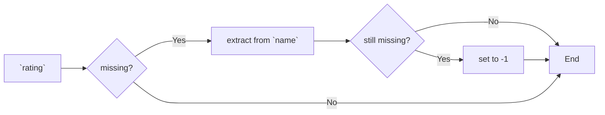
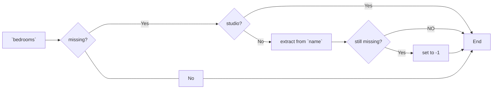
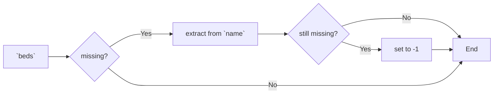

* https://arup-group-social-data-run-lodl36.streamlit.app/?page=Equity+Explorer
* https://snow-table-catalog.streamlit.app/

* data cleansing
  * dataset to use: `S4/listings.csv`
  * 
* model
* service
* Docker

## Data cleasing

### Feature selection

* The ultimate goal of our project is to predict the price of Airbnb room for customers by giving information they care about when looking for a rental. In this way, features that customers will probably be interested in, including room type, accommodates, neighborhood, review ratings and so on, were selected for further analysis.
* As a result, all selected features are: neighborhood, room type, bathroom type, bedroom number, bathroom number, beds number, and review rating.
* As some of our selected features were not explicitly listed in the raw dataset, features such as beds number, bedroom number and bathroom type will be extracted from columns like `name` and `bathrooms_text`.

### Handling of missing values and feature extraction

* We will give the prediction of `price` in this project, since 378 of 6882 rooms have missing `price` values, these records will be simply removed from further analysis.
* Primary analysis for all selected features are listed below:
    * **neighborhood**: explicitly included in the `neighbourhood` column
    * **room type**: explicitly included in the `room_type` column
    * **bedroom number**: implicitly included in the `name` column
    * **beds number**: implicitly included in the `name` column
    * **bathroom type**: implicitly included in the `bathrooms_text` column
    * **bathroom number**: implicitly included in the `bathrooms_text` column
    * **review rating**: some of rating scores were missing from `review_scores_rating` column, for these records, we will try to extract the rating value from `name` column

Logics for handling NA values in selceted features:

* rating：missing values will be sustituted using information extracted from column `name`

* **bedroom**: If bedroom is marked as `studio`, the bedroom number will be set as 0. Otherwise, missing values will be sustituted using information extracted from column `name`

* **bed numbers**: missing values will be sustituted using information extracted from column `name`

### Data type and encoding

- `price` has to be float type rather than string
- Features including `neighbourhood`, `room_type` and `bath_type` are categorical data, we thus convert these values into one-hot encoding pattern.
